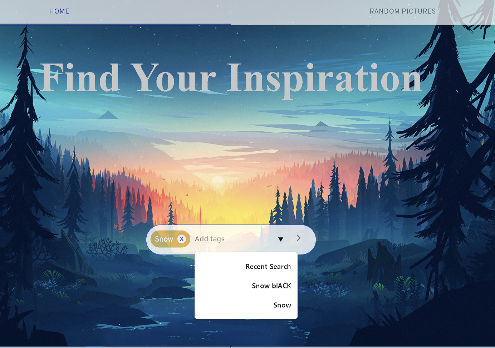

# Photo Search Engine

photos search engine by user tags.

## Table Of Contents
- [Photo Search Engine](#Photo Search Engine)
  - [Contributors](#contributors)
  - [Table Of Contents](#table-of-contents)
  - [Running the project](#running-the-project)
  - [Screenshots](#screenshots)
    - [Home](#home)
    - [HistorySearch](#HistorySearch)
    - [RandomSearch](#RandomSearch)
    - [PhotosByTags](#PhotosByTags)

  - [Tech-stack](#tech-stack)

## Running the project
1. Clone the repo.
2. Run `npm install`.
3. Navigate to .env file in root of project and insert PixaBay key in  `REACT_APP_API_KEY=YOURE_Pixabay_API_KEY_HERE`
4. npm start.
5. Navigate to `http://localhost:3000`.

## Screenshots

### Home
The user can add tags for search by tapping space and then click the search.

### HistorySearch
The user can see his 3 last search and add them to input by click and tap space.

### RandomSearch
The user can see Random pictures

### PhotosByTags
user can see the photos by his tags

## Tech-stack
1. React-hooks , Mobx , Material-UI, React-Icons, and Axios, PixaBay Api
